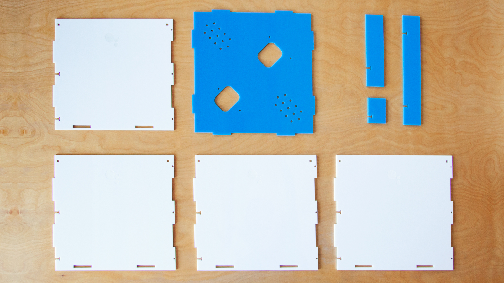

# Google Assistant SDK Demo: TalkToLight
---

## Let's make a Google Assistant to look like it's made out of light

[Red Paper Heart](http://redpaperheart.com) designed an open source interactive art installation that would showcase the potential of the Google Assistant SDK from RPH's point of view. The goal? To inspire developers and makers everywhere to experiment and build with it themselves, just like we did.

We were moved by the opportunity to translate this remarkable new reality of ours into an interaction that’s as comical as it is inspiring – to express the kind of wonder and humor we feel when using the Assistant, because that’s how we do.

So, we created [TalkToLight](http://redpaperheart.com/work/talktolight).

### Features:

- Modular software design allows you to customize your light and add more modes
- Voice-controlled light that triggers different graphics based to following commands:

  "Talk like...
  - a spotlight.
  - a disco ball.
  - a rainbow.
  - a robot.
  - a scanner.
  - a laser.
  - an aurora borealis / northern lights.
  - a spaceship.
  - an alien.
  - fire flies.

## What You'll Need

Besides a Raspberry Pi, Talk To Light can be build with different components and is fairly flexible in its set up. You do need at least one USB microphone (webcams work too), a speaker (USB, audio via HDMI or 3.5mm jack) and a projector. The Housing is optional but it makes it look much better. We built the housing around a specific projector and you might need to adjust the housing measurements if you use a different one.

- **Estimated time to assemble:** 3h + time to build the housing
- **Difficulty:** Beginner
- **Cost:** Electronics $120 + projector $799 + housing material ~$100

### Essentials - the tech

Before you begin, you'll need the following components:

- Raspberry Pi 3 Model B and power supply
- 1 x USB microphone for the Google Assistant SDK
- 1 x USB microphone for audio reactive ofx app.
- Speaker (preferably USB)
- An SD card with [NOOBS](https://www.raspberrypi.org/downloads/noobs/) pre-installed. NOOBS is an OS installer that contains Raspbian by default and simplifies OS setup.
- USB keyboard, USB mouse, HDMI display / projector.

Please see our [recommended hardware](docs/HARDWARE.md) list for further details.

### Optional - the housing
Main goal was to hide the tech and make it look like a lamp.
We used precisely laser cut acrylic but you could also build a housing any other materials that are readily available to you and your imagination.

---
# Raspberry Pi: Hardware and Software setup

## Embed the Google Assistant

### Set Up Hardware and Network Access
- Connect the microphones and the speaker to the Raspberry Pi
- Insert the SD card into the Raspberry Pi ([raspbian-2017-07-05](http://downloads.raspberrypi.org/raspbian/images/raspbian-2017-07-05/) already loaded)
- Connect a USB keyboard, USB mouse and display to your Raspberry Pi
- Plug in an ethernet cable or [connect to a WiFi network](https://www.raspberrypi.org/documentation/configuration/wireless/desktop.md).
- Start up the Raspberry Pi

#### Configure the date and time.
Check that the date and time are set correctly on the device.

    $ date

An incorrect date or time may cause SSL errors. Restart the device to automatically set the correct date and time from a time server or use the `date --s=<STRING>` command to set them manually.

### Configure and Test the Audio

Before running any applications that use the Google Assistant SDK, you must configure the audio system on the Raspberry Pi. (See also [Google Assistant SDK Guide : Configure and Test the Audio ](https://developers.google.com/assistant/sdk/guides/library/python/embed/audio ))

- On a terminal window, find your recording and playback devices.

    1. Locate one of your USB microphones in the list of capture hardware devices. Write down the card number and device number of the microphone that you want to use for the Google Assistant SDK.

            $ arecord -l

    2. Locate your speaker in the list of playback hardware devices. Write down the card number and device number of the speaker that you want to use for the Google Assistant SDK. Note that the 3.5mm-jack is typically labeled Analog or bcm2835 ALSA (not bcm2835 IEC958/HDMI).

            $ aplay -l

    3. Create a new file named .asoundrc in the home directory (/home/pi). Make sure it has the right slave definitions for microphone and speaker; use the configuration below but replace <card number> and <device number> with the numbers you wrote down in the previous step. Do this for both pcm.mic and pcm.speaker.

            pcm.!default {
              type asym
              capture.pcm "mic"
              playback.pcm "speaker"
            }
            pcm.mic {
              type plug
              slave {
                pcm "hw:<card number>,<device number>"
              }
            }
            pcm.speaker {
              type plug
              slave {
                pcm "hw:<card number>,<device number>"
              }
            }

    4. Verify that recording and playback work:

      - Adjust the playback volume.

              alsamixer
      Press the up arrow key to set the playback volume level to around 70.

      - Play a test sound (this will be a person speaking). Press Ctrl+C when done. If you don't hear anything when you run this, check your speaker connection.

              speaker-test -t wav
      - Record a short audio clip.

              arecord --format=S16_LE --duration=5 --rate=16000 --file-type=raw out.raw
      - Check the recording by replaying it. If you don't hear anything, you may need to check the recording volume in alsamixer.

              aplay --format=S16_LE --rate=16000 out.raw

      If recording and playback are working, then you are done configuring audio. If not, check that the microphone and speaker are properly connected. If this is not the issue, then try a different microphone or speaker.

      Note that if you have both an HDMI display and a 3.5mm jack speaker connected, you can play audio out of either one. Run the following command:

            sudo raspi-config
Go to Advanced options > Audio and select the desired output device

Note: Sound setup might have to be repeated every time you restart the pi or if you plug in/out any of the microphones/speakers as `<card number>` and `<device number>` might change and would need to be adjusted within the .asoundrc file each time

### Configure a Developer Project and Account Settings

See also [Google Assistant SDK Guide:
Configure a Developer Project and Account Settings](https://developers.google.com/assistant/sdk/guides/library/python/embed/config-dev-project-and-account)

#### Configure a Google Developer Project
A Google Developer Project gives your device access to the Google Assistant API. The project tracks quota usage and gives you valuable metrics for the requests made from your device.

To enable access to the Google Assistant API, do the following on the Raspberry Pi:

1. In the Cloud Platform Console, [go to the Projects page](https://console.cloud.google.com/project). Create a new project called *"Talk to Light"*.

- [Enable the Google Assistant API](https://console.developers.google.com/apis/api/embeddedassistant.googleapis.com/overview) on the project (see the Terms of Service).

- Create an OAuth Client ID with the following steps:

  - [Create the client ID](https://console.developers.google.com/apis/credentials/oauthclient).

  - You may need to set a product name for the product consent screen. On the **OAuth consent screen** tab, give the product a name and click **Save**.

  - Click **Other** and give the client ID a name like *"Talk to Light Client Id"*.

  - Click Create. A dialog box appears that shows you a client ID and secret. (No need to remember or save this, just close the dialog.)

  - Click ⬇ (at the far right of screen) for the client ID to download the client secret JSON file (`client_secret_<client-id>.json`).

- Locate the `client_secret_<client-id>.json` file in the download folder and move it to /home/pi.

#### Set activity controls for your account
In order to use the Google Assistant, you must share certain activity data with Google. The Google Assistant needs this data to function properly; this is not specific to the SDK.

Open the [Activity Controls page](https://myaccount.google.com/activitycontrols) for the Google account that you want to use with the Assistant. You can use any Google account, it does not need to be your developer account.

Ensure the following toggle switches are enabled (blue):

- Web & App Activity
    - In addition, be sure to select the Include Chrome browsing history and activity from websites and apps that use Google services checkbox.
- Device Information
- Voice & Audio Activity

### Install the SDK and Sample Code
See also [Google Assistant SDK : Install the SDK and Sample Code](https://developers.google.com/assistant/sdk/guides/library/python/embed/install-sample)

To keep things separate and to easily find everything related to this project, we created a new project folder. We called this folder *"rph"* but you can of course pick any name of your choice.

      mkdir rph
      cd rph

All following steps are executed within this folder.

#### Configure a new Python virtual environment

Use a Python virtual environment to isolate the SDK and its dependencies from the system Python packages.

For Python 3:

    pi:~/rph $ sudo apt-get update
    pi:~/rph $ sudo apt-get install python3-dev python3-venv # Use python3.4-venv if the package cannot be found.
    pi:~/rph $ python3 -m venv env
    pi:~/rph $ env/bin/python -m pip install --upgrade pip setuptools wheel
    pi:~/rph $ source env/bin/activate

#### Get the library and sample code
The Google Assistant SDK package contains all the code required to get the Google Assistant running on the device, including the library and sample code.

Install the package's system dependencies:

    (env) pi:~/rph $ sudo apt-get install portaudio19-dev libffi-dev libssl-dev

Use pip to install the latest version of the Python package in the virtual environment:

    (env) pi:~/rph $ python -m pip install --upgrade google-assistant-library
    (env) pi:~/rph $ python -m pip install --upgrade google-assistant-sdk[samples]

#### Generate credentials

1. Install or update the authorization tool:

        (env) pi:~/rph $ python -m pip install --upgrade google-auth-oauthlib[tool]

2. Generate credentials to be able to run the sample code and tools. Reference the JSON file you downloaded in a previous step.

        (env) pi:~/rph $ google-oauthlib-tool --scope https://www.googleapis.com/auth/assistant-sdk-prototype --save --headless --client-secrets /home/pi/rph/client_secret_<client-id>.json

      You should see a URL displayed in the terminal:

        Please visit this URL to authorize this application: https://...

3. Copy the URL and paste it into a browser (this can be done on any machine). The page will ask you to sign in to your Google account. Sign into the Google account that created the developer project in the previous step.

4. After you approve the permission request from the API, a code will appear in your browser, such as "4/XXXX". Copy and paste this code into the terminal:

        Enter the authorization code:

      If authorization was successful, you will see a response similar to the following:

        credentials saved: /path/to/.config/google-oauthlib-tool/credentials.json

      If instead you see InvalidGrantError, then an invalid code was entered. Try again, taking care to copy and paste the entire code.

### Register the Device Model
See also [Google Assistant SDK : Register the Device Model](https://developers.google.com/assistant/sdk/guides/library/python/embed/register-device)

In order for the Google Assistant to respond to commands appropriate to your device and the given context, the Assistant needs information about your particular device.

The sample code includes a registration tool for your convenience. Make sure you run the tool in the same directory you used to generate your credentials. Also, note that you must be an Owner or Editor of a given Google Developer Project to register models for it.

#### Use the registration tool to register a device model

In the following command, replace `my-model` with whatever you want to call your model. Note that this name must be globally unique so you should use your Google Developer Project ID as a prefix to help avoid collisions (for example, my-dev-project-my-model-1. Also, don't be surprised that `talk-to-light-model-1` does not work as we already registered that.)

    (env) pi:~/rph $ cd ..
    (env) pi:~ $ googlesamples-assistant-devicetool register-model --model my-model --manufacturer "Red Paper Heart" --product-name "Talk to Light" --type LIGHT --trait Osc --trait catMode --trait discoMode --trait lightMode --trait spotlightMode --trait scannerMode --trait robotMode --trait spaceshipMode --trait alienMode --trait fireflyMode --trait rainbowMode --trait auroraMode --trait kittMode

Now query the server for the model you just created.

    (env) pi:~ $ googlesamples-assistant-devicetool get --model talk-to-light-model-1

You can run the register command again and supply any (or all) of these arguments to update the model. See the device model JSON [reference](https://developers.google.com/assistant/sdk/reference/device-registration/model-and-instance-schemas.html#device_model_json) for more information.

#### List the device models

You can check all the device models created under your developer project at any time by using the command below:

    (env) pi:~ $ googlesamples-assistant-devicetool list --model

Note: To see the full list of commands for the registration tool, see the Registration Tool Help.

### Run the Sample Code (optional)
See also [Google Assistant SDK : Run the Sample Code](https://developers.google.com/assistant/sdk/guides/library/python/embed/run-sample)

At this point, you are ready to run the sample and make a query.

In the following command, replace `my-dev-project` with your Google Developer Project ID. Replace `my-model` with the name of the model you created in the previous step.

    (env) pi:~ $ googlesamples-assistant-hotword --project_id my-dev-project --device_model_id my-model
Say Ok Google or Hey Google, followed by your query. You can try some of the following:

- Who am I?
- What time is it?
- What is the weather in San Francisco?

If the Assistant does not respond, follow the [troubleshooting instructions](https://developers.google.com/assistant/sdk/guides/library/troubleshooting#hotword).

#### Get the device instance ID
When you run the sample, it will generate a device instance for your particular device. This device instance will be associated with the device model that you specified to run the sample. Find the device instance ID in the output for the sample. You will use this ID to update your device so you can use Device actions.

    device_model_id: my-model
    device_id: 1C3E1558B0023E49F71CA0D241DA03CF # Device instance ID
    ON_MUTED_CHANGED:
    {'is_muted': False}
    ON_START_FINISHED
    ...

---

## Set up all Talk To Light applications

- Clone the repository and all submodules
      (env) pi:~ $ cd rph
      (env) pi:~/rph $ git clone --recursive https://github.com/redpaperheart/talktolight

- Install additional python libraries
      (env) pi:~/rph $ pip install python-osc

## Set up the Talk To Light Python App

This python application uses the Google Assistant Library to connect to the Google Assistant. It uses the microphone and speaker that was defined in the .asoundrc file. The application will run in the background and all events are sent to the TalkToLight graphics app via OSC.

### Register Custom Device Actions

See also [ Google Assistant SDK : Register Custom Device Actions](https://developers.google.com/assistant/sdk/eap/device-actions/partner/library/custom-actions)

#### Deploy the Talk To Light Action Package

1. [Go to the Actions Console](https://console.actions.google.com/) and add/import your Talk to Light Google Developer Project. (Select the project you used to register your device models and instances.)

  Note: Don't worry about stepping through the wizard in the Actions Console. You only need to import your project to enable the Actions on Google API for the project.

2. [Download](https://developers.google.com/actions/tools/gactions-cli) the `gactions` command line tool (Linux - arm).

  Locate the downloaded gactions file in the downloads folder and move it to /home/pi/rph/
  Run `chmod +x gactions` to make the downloaded binary executable.

3. Now make the Action Package accessible to the Google Assistant Server. Save your Action Package to Google by using the gactions CLI. Replace `my-project-id` with your Google Developer Project ID.
        (env) pi:~/rph $ ./gactions update --action_package talktolight/py/deviceActions.json --project my-project-id
Note: If you see the message Requested entity is not found, then you need to import your project in the Actions Console.

4. The first time you run this command you will be given a URL and be asked to sign in. Copy the URL and paste it into a browser (this can be done on any machine). The page will ask you to sign in to your Google account. Sign into the Google account that created the developer project in a previous step.

5. After you approve the permission request from the API, a code will appear in your browser, such as "4/XXXX". Copy and paste this code into the terminal:

        Enter the authorization code:
  If authorization was successful, you will see a response similar to the following: `Your app for the Assistant for project my-devices-project was successfully updated with your actions.`

6. Deploy your action package into test mode by using the gactions CLI. You must have saved your Action Package to Google at least once before running this command. Test mode enables the action package on your user account only.

        (env) pi:~/rph $ ./gactions test --action_package talktolight/py/deviceActions.json --project my-project-id
Note: Currently, you cannot test the project using the Actions Web Simulator.

For more details on how to submit your Action Package for distribution, refer to the [Action Package reference documentation](https://developers.google.com/actions/distributing-your-apps).

### Start the Talk to Light python app

Open a new terminal. Replace `my-device-model-id` with your Device Model Id.

      pi:~ $ python -m rph.talktolight.py.talktolight --device_model_id my-device-model-id

Say Ok Google or Hey Google, followed by your query. Also, try some of the following custom actions:
- Talk like a spotlight.
- Talk like a disco ball.
- Talk like a rainbow.
- Talk like a robot.
- Talk like a scanner.
- Talk like a laser.
- Talk like the northern lights.
- Talk like the aurora borealis.
- Talk like a spaceship.
- Talk like an alien.
- Talk like fire flies.

If all custom device actions are registered correctly you should see outputs like

      ON_CONVERSATION_TURN_STARTED
      Sending OSC message: /assistant/question/start
      ON_END_OF_UTTERANCE
      ON_RECOGNIZING_SPEECH_FINISHED:
        {'text': 'talk like a rainbow'}
      ON_DEVICE_ACTION:
        {'requestId': '4234281480388488080', 'inputs': [{'payload': {'commands': [{'devices': [{'id': 'CF3ABDEFD535639F53DB9F6D900034E0'}], 'execution': [{'command': 'rainbowMode'}]}]}, 'intent': 'action.devices.EXECUTE'}]}
      Do command rainbowMode with params None
      Attempting change to rainbow mode
      Sending OSC message: /mode/rainbow
      ON_RESPONDING_STARTED:
        {'is_error_response': False}
      Sending OSC message: /assistant/response/start
      ON_RESPONDING_FINISHED
      ON_CONVERSATION_TURN_FINISHED:
        {'with_follow_on_turn': False}
      Sending OSC message: /assistant/response/end

## Set up the Talk To Light ofx Graphics App
The graphics application is build in [Open Frameworks](http://openframeworks.cc/) and receives all messages via OSC from the TalkToLight python app.

Install and compile OpenFrameworks following [this guide](http://openframeworks.cc/setup/raspberrypi/raspberry-pi-getting-started/). Make sure the OpenFrameworks folder sits at the same level as the repository folder, not inside of it.

    $ sudo raspi-config

    1. Select 1 Expand Filesystem and hit Enter
    2. Select 8 Advanced Options and hit Enter
    3. Select A3 Memory Split and hit Enter
    4. Type 256 and Hit <ok>

openFrameworks does not use the X11 Desktop for running OF applications. You can save GPU memory by disabling it. This is optional but suggested.

    5. Select 3 Boot Options
    6. Select B1 Console or B2 Console Autologin

Download openFrameworks

    $ cd rph
    $ wget http://openframeworks.cc/versions/v0.9.8/of_v0.9.8_linuxarmv6l_release.tar.gz
    $ mkdir openFrameworks
    $ tar vxfz of_v0.9.8_linuxarmv6l_release.tar.gz -C openFrameworks --strip-components 1

Install packages and compile openFrameworks:

    $ cd /home/pi/rph/openFrameworks/scripts/linux/debian
    $ sudo ./install_dependencies.sh
    $ make Release -C /home/pi/openFrameworks/libs/openFrameworksCompiled/project

Compile and run the Talk to Light app:

    $ cd rph/talktoLight/of/talkToLightGraphics
    $ make
    $ make run

Note: Compiling OpenFrameworks and the ofx Talk to Light application can take quite a bit of time.

### Setting up the app: Parameters and shortcuts

The app should start fullscreen. The most important shortcuts are:
- d - toggles the debug graphics
- f - toggles fullscreen
- ESC - closes the app

The ofx application reacts to audio. It picks one input device by default.
If you want it to use a different input device you can simple press the number key of the listed device id.

You should be all set up now. Say Ok Google or Hey Google, followed by a one of our custom actions or just a general query.

- Talk like a spotlight.
- Talk like a disco ball.
- Talk like a rainbow.
- ...

---

# The Housing (Home Edition)

## Laser Cut The Housing

You can find the EPS file to laser cut the acrylic [here](docs/housing-cut.eps).

## Assembling instructions

### Tools needed for the build are listed below:
- Screwdriver set
- Tape

### Parts
The box consists of seven different parts:
- Four white sides
- One base
- Two projector supports

*Obs: the projector we used has the focus control on the top, so we separated one of the supports in two parts in order to be able to adjust it freely.*

### Step 1

The base has two larger holes - the one farther from the corner is meant for the projector lens and the other one for ventilation while the small dot grids are meant for speakers and microphones.

Start by attaching the supports to the base using the #18-8 x 3/4" screws. Two screws per piece.

*Obs: the EPSON projector used in this instructions has the ventilation on the front. This might vary according to the model*

### Step 2

Connect the base to one of the white sides first - with Google Assistant logo facing out.

Do the same with a second piece matching the holes where the screws will be places. Use the #18-8 x 3/4" screws for this.
There are two screws on each edge, eight in total.

### Step 3

Repeat the previous step with the two remaining side pieces.

*Obs: we left the protection paper in the sides to keep light from leaking through the white acrylic.*

### Step 4

**After** putting the projector in place inside the box, take about 15 feet of string and pass it through the small holes on the upper side of the edges in order to form an X on top of the box.

Make sure to pass the string at least four times on each diagonal for safety.

---

**Disclaimer:** THESE INSTRUCTIONS ARE BEING PROVIDED FOR INFORMATIONAL PURPOSES ONLY AND ARE NOT INTENDED TO BE USED FOR THE PRODUCTION OF COMMERCIAL PRODUCTS. BY EXECUTING THESE INSTRUCTIONS, YOU AGREE TO ASSUME ALL LIABILITY IN CONNECTION WITH YOUR BUILDING AND USE OF ANY DEVICE. RED PAPER HEART DISCLAIMS ALL WARRANTIES EXPRESS OR IMPLIED WITH RESPECT TO THESE INSTRUCTIONS AND ANY RESULTING DEVICE INCLUDING BUT NOT LIMITED TO WARRANTIES FOR MERCHANTABILITY, FITNESS FOR ANY PARTICULAR PURPOSE, AND NON-INFRINGEMENT. YOU SHOULD USE EXTREME CAUTION WHEN BUILDING AND USING ANY DEVICE PURSUANT TO THESE INSTRUCTIONS. IN NO EVENT SHALL RED PAPER HEART BE LIABLE FOR ANY CLAIM OR DAMAGES, INCLUDING BUT NOT LIMITED TO CLAIMS OR DAMAGES RELATED TO DEATH OR PERSONAL INJURY, PROPERTY DAMAGE, OR PRODUCT LIABILITY.
