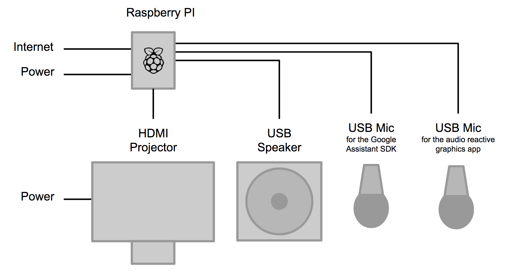

# Electronics - Home Edition

| Item | Part | Cost/Unit | Supplier (Link) | Quantity | Total cost (- shipping) |
| --- | --- | --- | --- | --- | --- |
| 1 | Raspberry Pi 3 | $35.00 | [Adafruit](https://www.adafruit.com/product/3055) | 1 | $35.00 |
| 2 | 16GB Card with NOOBS | $14.95 | [Adafruit](https://www.adafruit.com/product/1583) | 1 | $14.95  |
| 3 | 5V 2.4A Switching Power Supply for Pi| $7.5 | [Adafruit](https://www.adafruit.com/product/1995) | 1 | $7.50 |
| 4 | Mini External USB Stereo Speaker | $12.50 | [Adafruit](https://www.adafruit.com/product/3369) | 1 | $12.50 |
| 5 | USB Microphone | $21.99 | [Amazon](https://www.amazon.com/gp/product/B01D4HTIOY/) | 2 | $43.98 |
| 6 | Epson PowerLite 1284 Projector | $799 | [CDW](https://www.cdw.com/shop/products/Epson-PowerLite-1284-Projector-799.99-45-savings754.99-9-30/3767548.aspx?pfm=srh) | 1 | $799  |
| 7 | AmazonBasics High-Speed HDMI Cable, 3 Feet | $5.99 | [Amazon](https://www.amazon.com/AmazonBasics-High-Speed-HDMI-Cable-1-Pack/dp/B014I8SIJY) | 1 | $5.99 |

# Electronics - Installation Edition

| Item | Part | Cost/Unit | Supplier | Quantity | Total cost (- shipping) | Comment / Link |
| --- | --- | --- | --- | --- | --- | --- |
| 1 | Raspberry Pi 3 | $35.0 | Adafruit | 1 | $35.00 | https://www.adafruit.com/product/3055 |
| 2 | 5V 2.4A Switching Power Supply | $7.5 | Adafruit | 1 | $7.50 | https://www.adafruit.com/product/1995 |
| 3 | SYBA external USB Stereo Sound Adapter | $6.99 | Amazon | 1 | $6.99 | https://www.amazon.com/external-Adapter-Windows-Microphone-SD-CM-UAUD/dp/B001MSS6CS |
| 4 | MOTU UltraLite-mk4 | $595.00 | B&H | 1 | $595.00 |  https://www.bhphotovideo.com/c/product/1282538-REG/motu_8452_ultralite_mk4_18x22_usb_audio.html |
| 5 | Kustom PA PA50 Personal PA System | $99.99 | Guitar Center | 1 | $99.99 |  http://www.guitarcenter.com/Kustom-PA/PA50-Personal-PA-System-1304980282163.gc |
| 6 | Fifine Plug&Play USB Condenser Microphone | $21.99 | Amazon | 1 | $21.99 | https://www.amazon.com/gp/product/B01D4HTIOY/ |
| 7 | NEC NP-PA622U 6200 Lumen Projector | $3,699.00 | Amazon | 1 | $3,699.00 | https://www.amazon.com/NEC-NP-PA622U-Professional-Installation-Projector/dp/B00KJFHMY8 |
| 8 | NEC NP30ZL 0.79 to 1.04:1 Zoom Lens | $1710.65 | B&H | 1 | $1710.65 | https://www.bhphotovideo.com/c/product/1005498-REG/nec_np30zl_short_zoom_replacement_lens.html |
| 9 | AmazonBasics High-Speed HDMI Cable, 3 Feet | $5.99 | Amazon | 1 | $5.99 | https://www.amazon.com/AmazonBasics-High-Speed-HDMI-Cable-1-Pack/dp/B014I8SIJY |

# Housing

| Item | Part | Cost/Unit | Supplier | Quantity |  Total cost (- shipping)  | Comment / Link |
| --- | --- | --- | --- | --- | --- | --- |
| 1 | White Acrylic | ~$25 | | 1 | ~$25 | |
| 2 | Blue Acrylic |  ~$25 | | 1 | ~$25 | |
| 3 | 18-8 Stainless Steel Square Nut, 10-32 Thread Size| $8.80 | McMaster-Carr | 1 | $8.80 | https://www.mcmaster.com/#catalog/124/3285/=1brrhiy |
| 4 | 18-8 Stainless Steel Button Head Hex Drive Screw, 10-32 Thread Size, 3/4" Long | $8.48 | McMaster-Carr | 1 | $8.48 | https://www.mcmaster.com/#catalog/124/3076/=1brrhmb |
